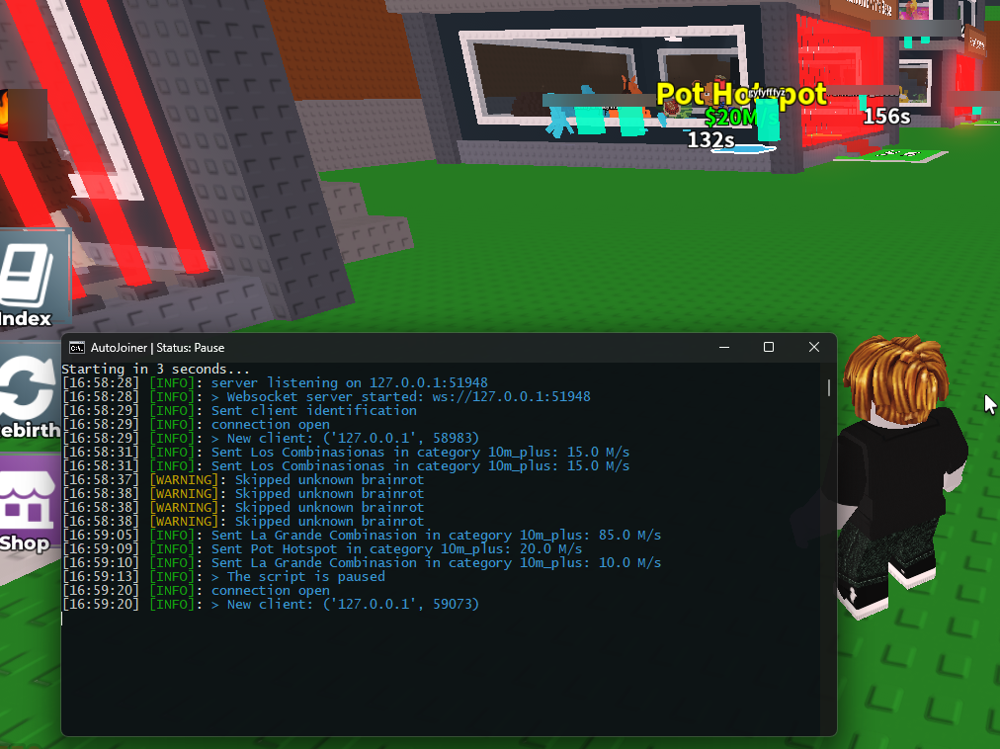

# 🧠 Roblox AutoJoiner for Chilli Notify's (Steal a Brainrot)

Software for automatic connection to servers in Roblox from logs in Chilli Hub (Steal A Brainrot place). Allows you to filter by the amount of "earnings per second" at the brainrot, by the number of players on the server, allows you to ignore "unknown" brainrots and automatically connect to the server.

## ⚙️ Features
- Income filtering - does not connect to servers if the brainrot income per second is lower than specified in the kfg.
- Filtering by number of players - does not connect to servers with more players than specified in the kfg.
- Uses a Discord token to listen to messages from Chilli Notify via WebSocket.
- Fully automatic launch using a Lua script.
- Bypasses login to servers with 10m+ brainrates.
- Ignores “Unknown” brainrates if this option is enabled in the kfg.
- Ability to log in only with specified brainrates
- Ability to skip specified brainrates

## 📥 Installation
1. Install Python 3.12 or higher (with a tick add to path): [click](https://www.python.org/downloads/release/python-3120/)
2. Download or clone the repository.
3. Run `setup.bat` - it will automatically install all libraries.
4. Wait for the installation to complete and configure the config.py file (open it with notepad):
5. Go to the `data` folder, find the `joiner.lua` file and copy it to the `AutoExec` folder of your executor.
6. Run `start.bat`.
7. F2 - pause/resume the script.

## ⭐ Project support
- If you found this script useful, please give it a star ⭐ on the repository. This motivates me to develop it further and create new projects.
